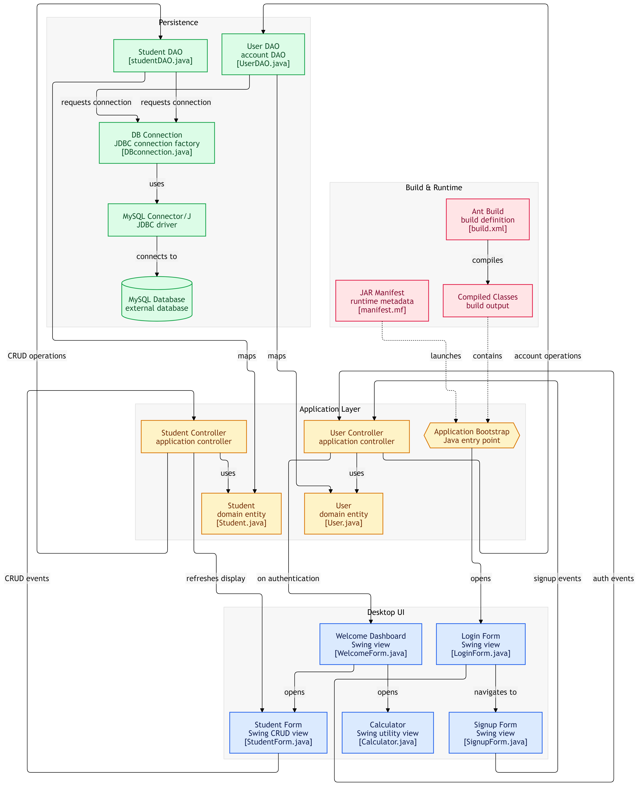

# 🎓 Student Management Java Application

A desktop Java application developed in Apache NetBeans as a university practice assignment to strengthen core programming concepts, object-oriented principles, database connectivity, and desktop user interface design.

---
## 📊 Project Diagram



---
## 🚀 Features

* **User Authentication:** Secure **Login** and **Signup** system handled via dedicated controllers and data access objects (DAO) to control application access.
* **Complete CRUD Operations:** 
  * **Add Data:** Insert new student records seamlessly through the graphical interface.
  * **View Data:** Display and browse stored records in real-time.
  * **Edit Data:** Update and modify existing student information.
  * **Delete Data:** Remove unwanted records from the database system.
* **Integrated Calculator:** A built-in calculator utility module to perform quick mathematical computations directly within the application.

---

## 🛠️ Built With

* **Language:** Java
* **IDE:** Apache NetBeans
* **GUI Framework:** Java Swing
* **Build Tool:** Apache Ant (`build.xml`)
* **Architecture:** MVC (Model-View-Controller) with DAO pattern

---

## 📂 Project Architecture

```text
src/
├── controller/     # Handles business logic and user actions
├── dao/            # Data Access Objects for database communication
├── db/             # Database connection and test configurations
├── model/          # Entity classes (Student, User)
├── studentmanagement/ # Main entry point
└── view/           # Java Swing forms and UI components (.java & .form)

```
## 📂 Getting Started

Follow the instructions below to set up and run the project locally on your machine.

### Prerequisites
* Install the Java Development Kit (JDK).
* Install the Apache NetBeans IDE.
* Ensure you have your database set up and configured in the `db` package (`DBconnection.java`).

### Installation & Execution
1. **Clone the repository:**
   ```bash
   git clone [https://github.com/pahansanjana/studentmanagement-java.git](https://github.com/pahansanjana/studentmanagement-java.git)
   ```
## Open the project in NetBeans:
* Launch Apache NetBeans.
* Go to **File > Open Project** and select the cloned `StudentManagement` folder.

## Run the application:
* Locate the project in the NetBeans Projects panel.
* Right-click the project folder and select **Run**.


## 📌 Usage

* Launch the application to view the **Login / Signup** screen.
* Create a new user account or log in with existing database credentials.
* Use the dashboard to **Add, View, Edit, or Delete** student data.
* Access the **Calculator** module from the menu whenever you need quick calculations.

---
*Developed as a university practice assignment.*
